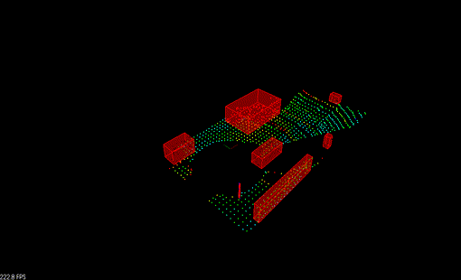

# Lidar Obstacle Detection


This project showcases a lidar point cloud data processing pipeline that could facilitate obstacle detection for a self-driving vehicle. This project depends on functinality provided by the [Point Cloud Library (http://pointclouds.org/)](PCL). In addition, this project implements the following:
- A RANSAC algorithm to approximate a plane representing the ground. This is used separate points on th ground from the rest of the point cloud. The implementation of this algorithm is provided in the [src/processPointClouds.cpp](src/processPointClouds.cpp) file.
- A Euclidean clustering algorithm, used to segment obstacles represented by the remaining lidar points. This clustering algorithm internally uses a k-d tree to quickly find approximate nearest neighbors for each point in the point cloud. The implementation of this algorithm is provided in the [src/processPointClouds.cpp](src/processPointClouds.cpp) file. The k-d tree implementation can be found in the [src/kdtree.h](src/kdtree.h) file.

### Demo
#### First set of point clouds




### Results 
The first gif in the above [Demo](#demo) section illustrates the initial (unprocessed) point cloud data. Below it, the second gif illustrates the processed point cloud data, including bounding box representations of clustered points belonging to various obstacles such as other cars, road signs, and bicyclists).


### Dependencies
- cmake >= 3.14
- gcc/g++ >= 8.0
- PCL >= 1.2

### Build
```
$> mkdir build
$> cd build
$> cmake ..
$> make
$> cd ..
```

### Run
```
$> build/lidar_obstacle_detection
```

## Installation

### Linux Ubuntu 16

Install PCL, C++

The link here is very helpful, 
https://larrylisky.com/2014/03/03/installing-pcl-on-ubuntu/

A few updates to the instructions above were needed.

* libvtk needed to be updated to libvtk6-dev instead of (libvtk5-dev). The linker was having trouble locating libvtk5-dev while building, but this might not be a problem for everyone.

* BUILD_visualization needed to be manually turned on, this link shows how to do that,
http://www.pointclouds.org/documentation/tutorials/building_pcl.php

